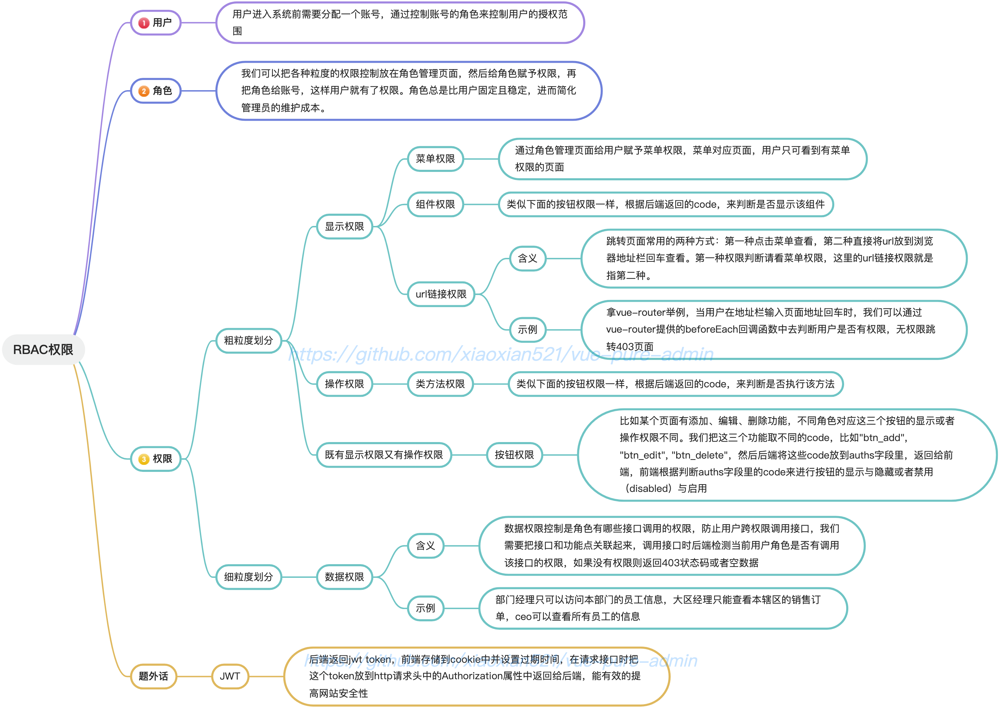

# Blog 个人博客
## Spring Security 
[源码解析](https://blog.csdn.net/qq_45635939/article/details/134104935)

## 数据库

~~~sql
create table qf_user(
	id int NOT NULL AUTO_INCREMENT,
    username varchar(255) COMMENT '用户名',
    nickname varchar(255) COMMENT '昵称',
    password char(60) COMMENT '密码',
    sex char(1) COMMENT '性别',
    mobile char(11) COMMENT '手机号',
    enable bit COMMENT '是否开启',
    del_status bit COMMENT '删除状态',
    create_time datetime COMMENT '创建时间',
    update_time datetime COMMENT '修改时间',
    create_by varchar(255) COMMENT '创建者',
    update_by varchar(255) COMMENT '修改者',
    PRIMARY KEY (id) USING BTREE
);

create table qf_role(
	id INT NOT NULL AUTO_INCREMENT,
    name varchar(255) COMMENT '角色名称',
    tag varchar(255) COMMENT '角色标签',
    remark varchar(255) COMMENT '角色描述',
    del_status bit COMMENT '删除状态',
    create_time datetime COMMENT '创建时间',
    update_time datetime COMMENT '修改时间',
    create_by varchar(255) COMMENT '创建者',
    update_by varchar(255) COMMENT '修改者',
    PRIMARY KEY (id) USING BTREE
);

create table qf_menu(
	id INT NOT NULL AUTO_INCREMENT COMMENT '菜单Id',
    name varchar(50) NOT NULL COMMENT '菜单名',
    icon varchar(50) COMMENT '菜单icon',
    path varchar(50) COMMENT '路由地址',
    component varchar(50) COMMENT '组件路径',
    perms varchar(100) DEFAULT NULL COMMENT '权限标识',
    type char(1) DEFAULT '' COMMENT '菜单类型（M-目录 C-菜单 F-按钮）',
    parent_id int COMMENT '父id',
    order_num tinyint COMMENT '排序',
    del_status bit COMMENT '删除状态 0-存在 1-删除',
    create_time datetime COMMENT '创建时间',
    update_time datetime COMMENT '修改时间',
    create_by varchar(255) COMMENT '创建者',
    update_by varchar(255) COMMENT '修改者',
    PRIMARY KEY (id) USING BTREE
)COMMENT '菜单权限表';

CREATE TABLE qf_user_role  (
  id int NOT NULL AUTO_INCREMENT,
  user_id int NULL DEFAULT NULL COMMENT '用户id',
  role_id int NULL DEFAULT NULL COMMENT '角色id',
  PRIMARY KEY (id) USING BTREE
);

CREATE TABLE qf_role_menu  (
  id int NOT NULL AUTO_INCREMENT,
  role_id int NULL DEFAULT NULL COMMENT '角色id',
  menu_id int NULL DEFAULT NULL COMMENT '菜单id',
  PRIMARY KEY (id) USING BTREE
);
~~~
### 插入数据
#### 菜单表
~~~sql
INSERT INTO `qf_menu` VALUES (1, '系统管理', NULL, 'system', '/system/home.vue', 'system', 'M', 0, 1, b'0', '2023-11-02 14:42:50', '2023-11-02 14:42:50', 'admin', 'admin');
INSERT INTO `qf_menu` VALUES (2, '系统监控', NULL, 'monitor', '/monitor/monitor.vue', 'monitor', 'M', 0, 2, b'0', '2023-11-02 14:42:50', '2023-11-02 14:42:50', 'admin', 'admin');
INSERT INTO `qf_menu` VALUES (3, '系统工具', NULL, 'tool', '/tool/tool.vue', 'tool', 'M', 0, 3, b'0', '2023-11-02 14:42:50', '2023-11-02 14:42:50', 'admin', 'admin');
INSERT INTO `qf_menu` VALUES (4, '个人中心', NULL, 'person', '/person/person.vue', NULL, 'M', 0, 4, b'0', '2023-11-02 14:42:50', '2023-11-02 14:42:50', 'admin', 'admin');
INSERT INTO `qf_menu` VALUES (100, '公告管理', NULL, 'notice', '/system/notice/notice.vue', 'system:notice', 'C', 1, 1, b'0', '2023-11-02 14:42:50', '2023-11-02 14:42:50', 'admin', 'admin');
INSERT INTO `qf_menu` VALUES (101, '用户管理', NULL, 'user', '/system/user/user.vue', 'system:user', 'C', 1, 2, b'0', '2023-11-02 14:42:50', '2023-11-02 14:42:50', 'admin', 'admin');
INSERT INTO `qf_menu` VALUES (102, '菜单管理', NULL, 'menu', '/system/menu/menu.vue', 'system:menu', 'C', 1, 3, b'0', '2023-11-02 14:42:50', '2023-11-02 14:42:50', 'admin', 'admin');
INSERT INTO `qf_menu` VALUES (103, '角色管理', NULL, 'role', '/system/role/role.vue', 'system:role', 'C', 1, 4, b'0', '2023-11-02 14:42:50', '2023-11-02 14:42:50', 'admin', 'admin');
INSERT INTO `qf_menu` VALUES (104, '文章管理', NULL, 'article_manage', '/system/article/article.vue', 'system:article', 'C', 1, 5, b'0', '2023-11-02 14:42:50', '2023-11-02 14:42:50', 'admin', 'admin');
INSERT INTO `qf_menu` VALUES (105, '日志管理', NULL, 'log', '/monitor/log/log.vue', 'system:log', 'C', 2, 1, b'0', '2023-11-02 14:42:50', '2023-11-02 14:42:50', 'admin', 'admin');
INSERT INTO `qf_menu` VALUES (106, '定时任务', NULL, 'job', '/monitor/job/job.vue', 'system:job', 'C', 2, 2, b'0', '2023-11-02 14:42:50', '2023-11-02 14:42:50', 'admin', 'admin');
INSERT INTO `qf_menu` VALUES (107, '数据监控', NULL, 'data', '/monitor/data/data.vue', 'system:data', 'C', 2, 3, b'0', '2023-11-02 14:42:50', '2023-11-02 14:42:50', 'admin', 'admin');
INSERT INTO `qf_menu` VALUES (108, '缓存监控', NULL, 'cache', '/monitor/cache/cache.vue', 'system:cache', 'C', 2, 4, b'0', '2023-11-02 14:42:50', '2023-11-02 14:42:50', 'admin', 'admin');
INSERT INTO `qf_menu` VALUES (109, '文章列表', NULL, 'article_list', '/system/article/article.vue', 'system:article', 'C', 104, 1, b'0', '2023-11-02 14:42:50', '2023-11-02 14:42:50', 'admin', 'admin');
INSERT INTO `qf_menu` VALUES (110, '分类管理', NULL, 'category', '/system/article/category.vue', 'article:category', 'C', 104, 2, b'0', '2023-11-02 14:42:50', '2023-11-02 14:42:50', 'admin', 'admin');
INSERT INTO `qf_menu` VALUES (111, '标签管理', NULL, 'tag', '/system/article/tag.vue', 'article:tag', 'C', 104, 3, b'0', '2023-11-02 14:42:50', '2023-11-02 14:42:50', 'admin', 'admin');
INSERT INTO `qf_menu` VALUES (112, '评论管理', NULL, 'comment', '/system/article/comment.vue', 'article:comment', 'C', 104, 4, b'0', '2023-11-02 14:42:50', '2023-11-02 14:42:50', 'admin', 'admin');
INSERT INTO `qf_menu` VALUES (113, '留言管理', NULL, 'message', '/system/article/message.vue', 'article:message', 'C', 104, 5, b'0', '2023-11-02 14:42:50', '2023-11-02 14:42:50', 'admin', 'admin');
INSERT INTO `qf_menu` VALUES (1000, '公告查询', NULL, '#', NULL, 'notice:list', 'F', 100, 1, b'0', '2023-11-02 14:42:50', '2023-11-02 14:42:50', 'admin', 'admin');
INSERT INTO `qf_menu` VALUES (1001, '添加公告', NULL, '#', NULL, 'notice:add', 'F', 100, 2, b'0', '2023-11-02 14:42:50', '2023-11-02 14:42:50', 'admin', 'admin');
INSERT INTO `qf_menu` VALUES (1002, '公告删除', NULL, '#', NULL, 'notice:del', 'F', 100, 3, b'0', '2023-11-02 14:42:50', '2023-11-02 14:42:50', 'admin', 'admin');
INSERT INTO `qf_menu` VALUES (1003, '公告修改', NULL, '#', NULL, 'notice:edit', 'F', 100, 4, b'0', '2023-11-02 14:42:50', '2023-11-02 14:42:50', 'admin', 'admin');
INSERT INTO `qf_menu` VALUES (1005, '用户查询', NULL, '#', NULL, 'user:list', 'F', 101, 1, b'0', '2023-11-02 14:42:50', '2023-11-02 14:42:50', 'admin', 'admin');
INSERT INTO `qf_menu` VALUES (1006, '用户新增', NULL, '#', NULL, 'user:add', 'F', 101, 2, b'0', '2023-11-02 14:42:50', '2023-11-02 14:42:50', 'admin', 'admin');
INSERT INTO `qf_menu` VALUES (1007, '用户修改', NULL, '#', NULL, 'user:edit', 'F', 101, 3, b'0', '2023-11-02 14:42:50', '2023-11-02 14:42:50', 'admin', 'admin');
INSERT INTO `qf_menu` VALUES (1008, '用户删除', NULL, '#', NULL, 'user:del', 'F', 101, 4, b'0', '2023-11-02 14:42:50', '2023-11-02 14:42:50', 'admin', 'admin');
INSERT INTO `qf_menu` VALUES (1009, '菜单新增', NULL, '#', NULL, 'menu:add', 'F', 102, 1, b'0', '2023-11-02 14:42:50', '2023-11-02 14:42:50', 'admin', 'admin');
INSERT INTO `qf_menu` VALUES (1010, '菜单修改', NULL, '#', NULL, 'menu:edit', 'F', 102, 2, b'0', '2023-11-02 14:42:50', '2023-11-02 14:42:50', 'admin', 'admin');
INSERT INTO `qf_menu` VALUES (1011, '菜单删除', NULL, '#', NULL, 'menu:del', 'F', 102, 3, b'0', '2023-11-02 14:42:50', '2023-11-02 14:42:50', 'admin', 'admin');
INSERT INTO `qf_menu` VALUES (1012, '角色查询', NULL, '#', NULL, 'role:list', 'F', 103, 1, b'0', '2023-11-02 14:42:50', '2023-11-02 14:42:50', 'admin', 'admin');
INSERT INTO `qf_menu` VALUES (1013, '角色新增', NULL, '#', NULL, 'role:add', 'F', 103, 2, b'0', '2023-11-02 14:42:50', '2023-11-02 14:42:50', 'admin', 'admin');
INSERT INTO `qf_menu` VALUES (1014, '角色修改', NULL, '#', NULL, 'role:edit', 'F', 103, 3, b'0', '2023-11-02 14:42:50', '2023-11-02 14:42:50', 'admin', 'admin');
INSERT INTO `qf_menu` VALUES (1015, '角色删除', NULL, '#', NULL, 'role:del', 'F', 103, 4, b'0', '2023-11-02 14:42:50', '2023-11-02 14:42:50', 'admin', 'admin');
INSERT INTO `qf_menu` VALUES (1020, '文章查询', NULL, '#', NULL, 'article:list', 'F', 109, 1, b'0', '2023-11-02 14:42:50', '2023-11-02 14:42:50', 'admin', 'admin');
INSERT INTO `qf_menu` VALUES (1021, '文章新增', NULL, '#', NULL, 'article:add', 'F', 109, 2, b'0', '2023-11-02 14:42:50', '2023-11-02 14:42:50', 'admin', 'admin');
INSERT INTO `qf_menu` VALUES (1022, '文章审核', NULL, '#', NULL, 'article:edit', 'F', 109, 3, b'0', '2023-11-02 14:42:50', '2023-11-02 14:42:50', 'admin', 'admin');
INSERT INTO `qf_menu` VALUES (1023, '文章删除', NULL, '#', NULL, 'article:del', 'F', 109, 4, b'0', '2023-11-02 14:42:50', '2023-11-02 14:42:50', 'admin', 'admin');
INSERT INTO `qf_menu` VALUES (1024, '查询分类', NULL, '#', NULL, 'category:list', 'F', 110, 1, b'0', '2023-11-02 14:42:50', '2023-11-02 14:42:50', 'admin', 'admin');
INSERT INTO `qf_menu` VALUES (1025, '添加分类', NULL, '#', NULL, 'category:add', 'F', 110, 2, b'0', '2023-11-02 14:42:50', '2023-11-02 14:42:50', 'admin', 'admin');
INSERT INTO `qf_menu` VALUES (1026, '修改分类', NULL, '#', NULL, 'category:edit', 'F', 110, 3, b'0', '2023-11-02 14:42:50', '2023-11-02 14:42:50', 'admin', 'admin');
INSERT INTO `qf_menu` VALUES (1027, '删除分类', NULL, '#', NULL, 'category:del', 'F', 110, 4, b'0', '2023-11-02 14:42:50', '2023-11-02 14:42:50', 'admin', 'admin');
INSERT INTO `qf_menu` VALUES (1028, '查询标签', NULL, '#', NULL, 'tag:list', 'F', 111, 1, b'0', '2023-11-02 14:42:50', '2023-11-02 14:42:50', 'admin', 'admin');
INSERT INTO `qf_menu` VALUES (1029, '添加标签', NULL, '#', NULL, 'tag:add', 'F', 111, 2, b'0', '2023-11-02 14:42:50', '2023-11-02 14:42:50', 'admin', 'admin');
INSERT INTO `qf_menu` VALUES (1030, '修改标签', NULL, '#', NULL, 'tag:edit', 'F', 111, 3, b'0', '2023-11-02 14:42:50', '2023-11-02 14:42:50', 'admin', 'admin');
INSERT INTO `qf_menu` VALUES (1031, '删除标签', NULL, '#', NULL, 'tag:del', 'F', 111, 4, b'0', '2023-11-02 14:42:50', '2023-11-02 14:42:50', 'admin', 'admin');
INSERT INTO `qf_menu` VALUES (1032, '评论审核', NULL, '#', NULL, 'comment:edit', 'F', 112, 1, b'0', '2023-11-02 14:42:50', '2023-11-02 14:42:50', 'admin', 'admin');
INSERT INTO `qf_menu` VALUES (1033, '删除评论', NULL, '#', NULL, 'comment:del', 'F', 112, 2, b'0', '2023-11-02 14:42:50', '2023-11-02 14:42:50', 'admin', 'admin');
INSERT INTO `qf_menu` VALUES (1035, '留言审核', NULL, '#', NULL, 'message:edit', 'F', 113, 1, b'0', '2023-11-02 14:42:50', '2023-11-02 14:42:50', 'admin', 'admin');
INSERT INTO `qf_menu` VALUES (1036, '留言删除', NULL, '#', NULL, 'message:del', 'F', 113, 2, b'0', '2023-11-02 14:42:50', '2023-11-02 14:42:50', 'admin', 'admin');
INSERT INTO `qf_menu` VALUES (1037, '添加任务', NULL, '#', NULL, 'job:add', 'F', 106, 1, b'0', '2023-11-02 14:42:50', '2023-11-02 14:42:50', 'admin', 'admin');
INSERT INTO `qf_menu` VALUES (1038, '修改任务', NULL, '#', NULL, 'job:edit', 'F', 106, 2, b'0', '2023-11-02 14:42:50', '2023-11-02 14:42:50', 'admin', 'admin');
INSERT INTO `qf_menu` VALUES (1039, '删除任务', NULL, '#', NULL, 'job:del', 'F', 106, 3, b'0', '2023-11-02 14:42:50', '2023-11-02 14:42:50', 'admin', 'admin');
~~~
#### 角色菜单表
~~~sql
INSERT INTO qf_role_menu VALUES (1, 1, 1);
INSERT INTO qf_role_menu VALUES (2, 1, 2);
INSERT INTO qf_role_menu VALUES (4, 1, 3);
INSERT INTO qf_role_menu VALUES (5, 1, 4);
INSERT INTO qf_role_menu VALUES (6, 1, 100);
INSERT INTO qf_role_menu VALUES (7, 1, 101);
INSERT INTO qf_role_menu VALUES (8, 1, 102);
INSERT INTO qf_role_menu VALUES (9, 1, 103);
INSERT INTO qf_role_menu VALUES (10, 1, 104);
INSERT INTO qf_role_menu VALUES (11, 1, 105);
INSERT INTO qf_role_menu VALUES (12, 1, 106);
INSERT INTO qf_role_menu VALUES (13, 1, 107);
INSERT INTO qf_role_menu VALUES (14, 1, 108);
INSERT INTO qf_role_menu VALUES (15, 1, 109);
INSERT INTO qf_role_menu VALUES (16, 1, 110);
INSERT INTO qf_role_menu VALUES (17, 1, 111);
INSERT INTO qf_role_menu VALUES (18, 1, 112);
INSERT INTO qf_role_menu VALUES (19, 1, 113);
INSERT INTO qf_role_menu VALUES (20, 1, 500);
INSERT INTO qf_role_menu VALUES (21, 1, 501);
INSERT INTO qf_role_menu VALUES (22, 1, 1000);
INSERT INTO qf_role_menu VALUES (23, 1, 1001);
INSERT INTO qf_role_menu VALUES (24, 1, 1002);
INSERT INTO qf_role_menu VALUES (25, 1, 1003);
INSERT INTO qf_role_menu VALUES (26, 1, 1004);
INSERT INTO qf_role_menu VALUES (27, 1, 1005);
INSERT INTO qf_role_menu VALUES (28, 1, 1006);
INSERT INTO qf_role_menu VALUES (29, 1, 1007);
INSERT INTO qf_role_menu VALUES (30, 1, 1008);
INSERT INTO qf_role_menu VALUES (31, 1, 1009);
INSERT INTO qf_role_menu VALUES (32, 1, 1010);
INSERT INTO qf_role_menu VALUES (33, 1, 1011);
INSERT INTO qf_role_menu VALUES (34, 1, 1012);
INSERT INTO qf_role_menu VALUES (35, 1, 1013);
INSERT INTO qf_role_menu VALUES (36, 1, 1014);
INSERT INTO qf_role_menu VALUES (37, 1, 1015);
INSERT INTO qf_role_menu VALUES (38, 1, 1016);
INSERT INTO qf_role_menu VALUES (39, 1, 1017);
INSERT INTO qf_role_menu VALUES (40, 1, 1018);
INSERT INTO qf_role_menu VALUES (41, 1, 1019);
INSERT INTO qf_role_menu VALUES (42, 1, 1020);
INSERT INTO qf_role_menu VALUES (43, 1, 1021);
INSERT INTO qf_role_menu VALUES (44, 1, 1022);
INSERT INTO qf_role_menu VALUES (45, 1, 1023);
INSERT INTO qf_role_menu VALUES (46, 1, 1024);
INSERT INTO qf_role_menu VALUES (47, 1, 1025);
INSERT INTO qf_role_menu VALUES (48, 1, 1026);
INSERT INTO qf_role_menu VALUES (49, 1, 1027);
INSERT INTO qf_role_menu VALUES (50, 1, 1028);
INSERT INTO qf_role_menu VALUES (51, 1, 1029);
INSERT INTO qf_role_menu VALUES (52, 1, 1030);
INSERT INTO qf_role_menu VALUES (53, 1, 1031);
INSERT INTO qf_role_menu VALUES (54, 1, 1032);
INSERT INTO qf_role_menu VALUES (55, 1, 1033);
INSERT INTO qf_role_menu VALUES (56, 1, 1034);
~~~
## 权限开发思路
先来说权限开发的思路，当我们设计好 RBAC 权限之后，具体到代码层面，我们有两种实现思路：

一、直接在接口/Service 层方法上添加权限注解，这样做的好处是实现简单，但是有一个问题就是权限硬编码，每一个方法需要什么权限都是代码中配置好的，后期如果想通过管理页面修改是不可能的，要修改某一个方法所需要的权限只能改代码。

二、将请求和权限的关系通过数据库来描述，每一个请求需要什么权限都在数据库中配置好，当请求到达的时候，动态查询，然后判断权限是否满足，这样做的好处是比较灵活，将来需要修改接口和权限之间的关系时，可以通过管理页面点击几下，问题就解决了，不用修改代码。


## Spring IOC
自定义获取容器中类的对象，使用静态方法调用，

但是当非容器类（没加以上注解时）使用@Autowired调用容器中的类时，注入对象为空，报空指针异常

创建工具类BeanUtils，在这个工具类中的getBean可以得到容器中的类，在非容器类中使用

~~~Java
@Component
public class BeanUtils implements ApplicationContextAware {
    /**
     * 以静态变量保存ApplicationContext,可在任意代码中取出ApplicaitonContext.
     */
    private static ApplicationContext context;

    /**
     * 实现ApplicationContextAware接口的context注入函数, 将其存入静态变量.
     */
    @Override
    public void setApplicationContext(ApplicationContext context) {
        BeanUtils.context = context;
    }

    public static ApplicationContext getApplicationContext() {
        return context;
    }

    /**
     * 从静态变量ApplicationContext中取得Bean, 自动转型为所赋值对象的类型.  方法返回值的类型由调用者决定
     */
    public static <T> T getBean(String name) {
        return (T) context.getBean(name);
    }

    /// 获取当前环境
    public String getActiveProfile() {
        return context.getEnvironment().getActiveProfiles()[0];
    }
}
~~~

非容器类中使用容器中的类

注解如果没有指定bean的名字，默认为小写开头的类名。例如类名是RouteTools，则spring返回routeTools的bean名。

或者注解加上bean名

> ```java
> @Bean(name = "名称")`或者`@Bean("名称") 或者 @Component("名称")
> ```
### json序列化保持字段顺序
~~~java
public class Person {
    @JSONField(ordinal = 1)
    private String name;
    @JSONField(ordinal = 2)
    private int age;
    @JSONField(ordinal = 3)
    private String address;
    // 省略getter和setter方法
}
~~~
