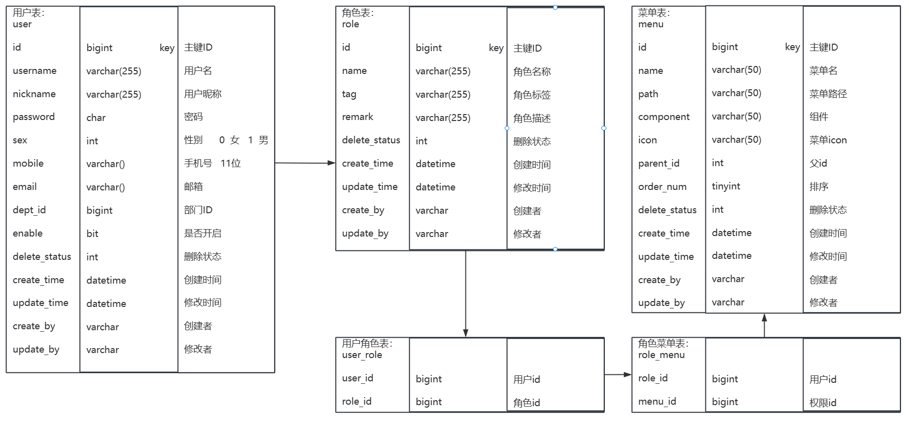

# Blog 个人博客
## Spring Security 
[源码解析](https://blog.csdn.net/qq_45635939/article/details/134104935)

## 数据库

~~~sql
create table qf_user(
	id int NOT NULL AUTO_INCREMENT,
    username varchar(255) COMMENT '用户名',
    nickname varchar(255) COMMENT '昵称',
    password char(60) COMMENT '密码',
    sex char(1) COMMENT '性别',
    mobile char(11) COMMENT '手机号',
    enable bit COMMENT '是否开启',
    del_status bit COMMENT '删除状态',
    create_time datetime COMMENT '创建时间',
    update_time datetime COMMENT '修改时间',
    create_by varchar(255) COMMENT '创建者',
    update_by varchar(255) COMMENT '修改者',
    PRIMARY KEY (id) USING BTREE
);

create table qf_role(
	id INT NOT NULL AUTO_INCREMENT,
    name varchar(255) COMMENT '角色名称',
    tag varchar(255) COMMENT '角色标签',
    remark varchar(255) COMMENT '角色描述',
    del_status bit COMMENT '删除状态',
    create_time datetime COMMENT '创建时间',
    update_time datetime COMMENT '修改时间',
    create_by varchar(255) COMMENT '创建者',
    update_by varchar(255) COMMENT '修改者',
    PRIMARY KEY (id) USING BTREE
);

create table qf_menu(
	id INT NOT NULL AUTO_INCREMENT,
    name varchar(50) COMMENT '菜单名',
    icon varchar(50) COMMENT '菜单icon',
    path varchar(50) COMMENT '菜单路径',
    component varchar(50) COMMENT '组件',
    parent_id int COMMENT '父id',
    order_num tinyint COMMENT '排序',
    del_status bit COMMENT '删除状态',
    create_time datetime COMMENT '创建时间',
    update_time datetime COMMENT '修改时间',
    create_by varchar(255) COMMENT '创建者',
    update_by varchar(255) COMMENT '修改者',
    PRIMARY KEY (id) USING BTREE
);

CREATE TABLE qf_user_role  (
  id int NOT NULL AUTO_INCREMENT,
  user_id int NULL DEFAULT NULL COMMENT '用户id',
  role_id int NULL DEFAULT NULL COMMENT '角色id',
  PRIMARY KEY (id) USING BTREE
);

CREATE TABLE qf_role_menu  (
  id int NOT NULL AUTO_INCREMENT,
  role_id int NULL DEFAULT NULL COMMENT '角色id',
  menu_id int NULL DEFAULT NULL COMMENT '菜单id',
  PRIMARY KEY (id) USING BTREE
);
~~~
### 插入数据
